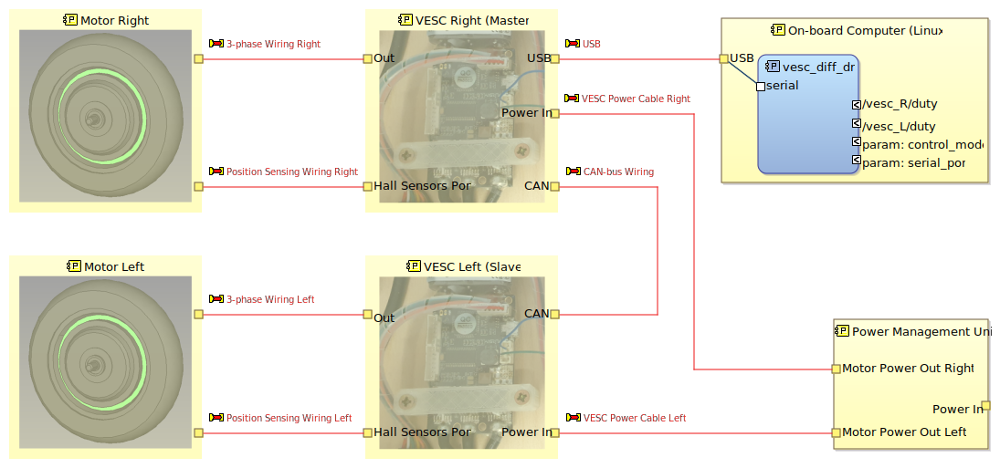
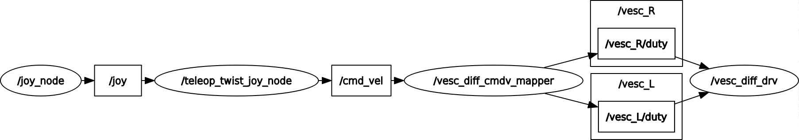

# ROS2 VESC Driver for Differential Drive Setup

## 1. Introduction

A basic python driver for VESC-based differential drive system that runs on ROS2-foxy

I made this tiny script for my robotic platform. The existing VESC drivers at the moment either don't support ROS2 or dont implement CAN chaining (pass command through to a CAN device). In my HW config I have 2x VESC devices connected via CAN. One of those acts as a master and connects to the host via serial (USB-serial).

The image below describes the physical context that this package is developed for.



## 2. Installation

You may deploy this package either natively or as a docker container,

For native use all you need is to clone the package into your workspace, install dependencies (pyserial) and build it.

```bash
cd ros2_ws
colcon build --packages-select ros2_vesc_drv
. install/bash.setup
```

For use with docker - clone the repo anywhere on target and build the image with

```bash
cd ros2_vesc_drv
docker build -t ros2_vesc_drv .
```

or build it elsewhere and push to / pull from your own docker registry

## 3. Package Contents

This packages provides a number of nodes and launch scripts to get throught the bring-up of the robot

**Nodes**:

- **vesc_diff_drv** - provides basic interface to the VESC controller over a serial connection (usb-serial by default but other things will work too).

- **vesc_diff_cmdv_mapper** - translates **/cmd_vel** into differential drive demands

**Launch scripts**:

- **vesc_cmd_vel.launch.py** - provides VESC driver for 3x CAN-chained controllers + diamond-steering mixer so that the whole thing could be controlled via /cmd_vel with linear.x for FWD / REW movement and angular.z for rotation
- **vesc_with_joy.launch.py** - builds on top of `vesc_cmd_vel.launch.py` but also adds joystic control; additionally requires joy and joy_teleop packages
- **joy_teleop.launch.py** - a helper launch file to spin-up joy and teleop-joy on a remote host for a scenario where the `vesc_cmd_vel.launch` is running on the target (robot) and joystick is connected to a host / development computer. Also requires all the related joy packages

### 3.1 vesc_diff_drv Node

Provides basic interface to the VESC controller over a serial connection (usb-serial by default but other things will work too).

ROS2 Subscriptions:

| Topic          | Description                                                                                                                           | Message Type |
| -------------- | ------------------------------------------------------------------------------------------------------------------------------------- | ------------ |
| `/vesc_L/duty` | Defines set-point for the "Left" motor; interpreted in the context of currently selected control mode (ROS parameter `control_mode`)  | `Float32`    |
| `/vesc_R/duty` | Defines set-point for the "Right" motor; interpreted in the context of currently selected control mode (ROS parameter `control_mode`) | `Float32`    |

to test the node you may publish some set-points via terminal:

```bash
ros2 topic pub --rate 10 /vesc_R/duty std_msgs/msg/Float32 data:\ 0.05\
```

The node supports dynamic parameter re-definition. The following parameters are supported:

| Parameter    | Description                                                       | Type   | Default Value  |
| ------------ | ----------------------------------------------------------------- | ------ | -------------- |
| serial_port  | path to the serial port that VESC master is attached to           | String | `/dev/ttyACM0` |
| control_mode | selects control mode; may be set to `duty`, `speed` or `position` | String | `duty`         |

the table below provides some additional detail to help with the control mode selection:

| Control mode | Uses e-brakes | Range                       |
| ------------ | ------------- | --------------------------- |
| duty         | yes           | -1.0 to 1.0                 |
| current      | no            | -I_LIM to I_LIM             |
| rpm          | yes           | RPM_LIM_LOW to RPM_LIM_HIGH |

You may want to pre-program those limitters using the vesc_tool

to change a parameter dynamically you may use rqt or terminal like so:

```bash
ros2 param set /vesc_diff_drv control_mode "position"
```

### 3.2 vesc_diff_cmdv_mapper Node

### 3.3 vesc_cmd_vel.launch.py Launch Script

### 3.4 vesc_with_joy.launch.py Launch Script

There is also a launch file that allows for teleoperation using joystick / cmd_vel topic. It implements the graph below:



The launch file has some parameters tuned for my platform (like speed limits) so you may need to tune those things a bit.

```bash
ros2 launch ros2_vesc_drv vesc_with_joy.launch.py
```

### 3.5 joy_teleop.launch.py Launch Script

## 4. Using the package

To run the nodes / launch files you may consider the following options:

Runninng a node or launch file from a native package (installed in a ROS2 workspace):

```bash
# to run a node use:
ros2 run ros2_vesc_drv <node name from section 3>

# to run a launch script use:
ros2 launch ros2_vesc_drv <launch script name from section 3>
```

Running the nodes or launch files in a docker container looks very similar to the above thing with only 2 exceptions - for the driver to use the comms you need to pass `--device=...` to point to the VESC serial file in `/dev` and also I didn't figure out yet what device I need to pass-through so that the joy package works in a container (but I also don't really need that in my application).

```bash
docker run -it --net=host --pid=host --device=/dev/ttyACM0 ros2_vesc_drv:latest ros2 <run or launch> ros2_vesc_drv <launch script or node from section 3>
```
